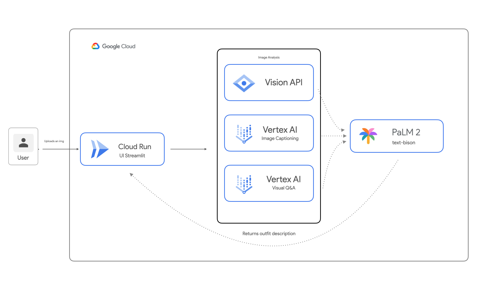

# GenAI Labs
`by gpalacin@`

This repo comprises a collection of individual labs focusing on generative AI within the Google Cloud Platform.

These rapid prototypes highlight various generative AI functionalities offered by Vertex AI and demonstrate their real-world applications.

The objective is to facilitate the easy deployment of this suite of demos on Cloud Run, using a straightforward front-end (streamlit) that, under the hood, invokes the Vertex AI APIs.

1. Prompt Coach
2. Fashion image descriptor
3. Chat interaction with podcast
4. Retrieval Aumented Generation + Langchain

> Note: Some of these demo content is in Spanish.

## Pre-requisites
Before starting you will need: 
1. A Google Cloud Project with a biilling account associated 
2. Shell environment with gcloud and git

## Set up
```bash
gcloud auth login
```
```bash
git clone https://github.com/willypalacin/GenAIDemos
```

Enable the following APIs
```bash 
gcloud services enable \
artifactregistry.googleapis.com \
vertexai.googleapis.com \
cloudbuild.googleapis.com \
cloudrun.googleapis.com \
compute.googleapis.com
```
All the demos will be deployed in Cloud Run. We need to create the container to store them.

```bash 
export PROJECT_ID=<project_id> //Replace
export REGION=<region> //Replace 

gcloud artifacts repositories create gen-ai-imgs \
--repository-format=docker \
--location=$REGION --description="Registry to store the demo images"
```

Each one of the demos contains a `config.yaml` file where the **project ID** needs to be specified, along with other attributes, to fully customize the demo for the particular use case needed.

## Demo 1 - Prompt Coach
Given a particular prompt, refine it with PaLM to coah the user and generate a high quality image.


<p align="center">
  
</p>


Build and push the image to artifact registry

> Note: Update the project ID in the config.yaml file before running the comands below

```
cd custom_img_gen

gcloud builds submit -t $REGION-docker.pkg.dev/$PROJECT_ID/gen-ai-imgs/img-caption . 

```
Deploy to Cloud Run

```
gcloud run deploy img-gen-service \
--image="${REGION}-docker.pkg.dev/${PROJECT_ID}/gen-ai-imgs/img-caption" \
--region=$REGION \
--allow-unauthenticated
```

# Demo 2 - Outfit descriptor - Fashion use case

The purpose of the demo is to use the Google Vision API, Image Captioning in Vertex, and PaLM2 to generate a description of the outfit given an image of a model  in Spanish and English.

<p align="center">
  
</p>



Build and push the image to artifact registry

> Note: Update the project ID in the config.yaml file before running the comands below

```
cd img_caption_with_vision

gcloud builds submit -t $REGION-docker.pkg.dev/$PROJECT_ID/gen-ai-imgs/img-descriptor .

```
Deploy to Cloud Run

```
gcloud run deploy img-gen-service \
--image="${REGION}-docker.pkg.dev/${PROJECT_ID}/gen-ai-imgs/img-descriptor" \
--region=$REGION \
--allow-unauthenticated
```

<p align="center">
  
</p>


# Demo 3 - Chat intercation with podcast

The goal of this demo is to be able to do interact with audio files, using a chat interface. 

To accomplish that task, the following services will be used: 
1. Speech to text
2. PaLM 2 (chat bison)